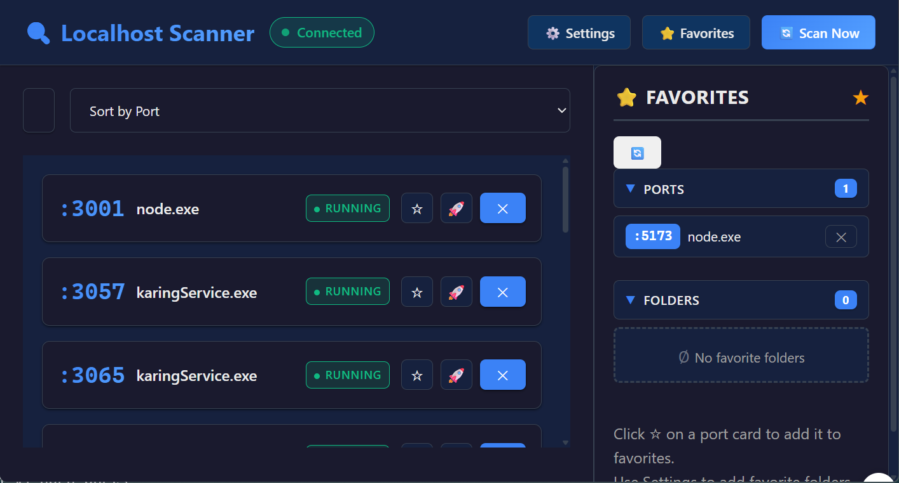

# Localhost Scanner




A web app for developers to scan, manage, and launch localhost development servers. Never wonder what ports you have open again.

## 🚀 Quick Start

```bash
# Clone the repo
git clone https://github.com/yourusername/localhost-scanner.git
cd localhost_scanner

# Install dependencies
npm install
cd client && npm install && cd ..

# Start the app
npm run dev
```

Visit [http://localhost:5173](http://localhost:5173) to start scanning your ports!

---

## Getting Started

### Prerequisites

- Node.js (v14 or higher)
- npm or yarn

### Installation

```bash
# Clone or download the project
cd localhost_scanner

# Install server dependencies
npm install

# Install client dependencies
cd client && npm install && cd ..
```

### Running the App

```bash
# Start both the server and client (recommended)
npm run dev

# Or run individually:
npm run server  # Backend only (port 3001)
npm run client  # Frontend only (port 5173)
```

Open http://localhost:5173 in your browser.

---

## What It Does

### The Problem

If you're like most developers, you probably have multiple dev servers running on different ports and often forget:
- What's running on port 3000? 4200? 8080?
- Which project folder does this belong to?
- Did I remember to close that server from yesterday?

### The Solution

This app scans localhost for open ports and shows you what's running on each one. You can see the process name, PID, and working directory. You can close ports, save your favorites, and even launch npm scripts from your project folders.

### ✨ Features


- Scans localhost for open ports (you choose the range)
- Shows process details: PID, name, command, working directory
- Auto-refreshes every 5 seconds via WebSocket
- Search and filter results


- Close/kill processes with one click
- Works on Windows, Linux, and Mac
- Asks you to confirm before killing anything
- Shows live connection status


- Mark frequently used ports as favorites
- Save your project folders for quick access
- Everything saves to `config.json`


- Launch npm scripts from your favorite folders
- Watch terminal output in real-time
- Supports `dev`, `start`, `build`, and `test` scripts


- Choose which port ranges to scan
- Set how often to auto-scan
- Switch between light and dark themes

---

## 📖 How to Use It

### Scanning Ports

When you open the app, it automatically scans for open ports. Each port shows up as a card with:
- Port number (with a nice gradient color)
- Process name
- Running status badge
- Action buttons

Use the search bar to filter by process name, folder path, or port number. Use the sort dropdown to organize by port, name, or PID.

### Closing Ports

Click the X button on any port card to close it. The app will ask you to confirm before killing the process. Note that some system processes can't be killed without admin privileges.

### Adding Favorites

Click the star (☆) button on a port card to add it to favorites. Favorite ports show up in the sidebar panel for quick access.

### Quick Launch

Click the rocket (🚀) button to launch an npm script from a folder. You'll see terminal output in real-time and can stop the script whenever you want.

### Settings

Click the gear (⚙️) icon to:
- Add or remove port ranges to scan
- Change how often the app auto-scans
- Switch between light and dark themes

---

## 📁 Project Structure

```
localhost_scanner/
├── server/
│   ├── index.js              # Express server with WebSocket
│   ├── port-scanner.js       # Scans ports on localhost
│   ├── process-manager.js    # Handles process detection & killing
│   └── favorites.js          # Manages favorites (ports and folders)
├── client/
│   ├── src/
│   │   ├── components/
│   │   │   ├── PortList.jsx      # Grid of port cards
│   │   │   ├── PortCard.jsx      # Individual port display
│   │   │   ├── FavoritesPanel.jsx # Sidebar for favorites
│   │   │   ├── QuickLaunch.jsx   # Modal for launching scripts
│   │   │   └── Settings.js      # Settings panel
│   │   ├── hooks/
│   │   │   ├── useWebSocket.js      # WebSocket connection
│   │   │   ├── usePortScanner.js    # Port scanning logic
│   │   │   ├── useFavorites.js     # Favorites management
│   │   │   └── useQuickLaunch.js   # Script launching
│   │   ├── App.jsx               # Main app component
│   │   ├── App.css                # App styles
│   │   └── index.css              # Global styles
│   └── package.json
├── config.json               # Your saved settings and favorites
└── package.json
```

---

## 📡 API Reference


### REST Endpoints

| Method | Endpoint | Description |
|--------|----------|-------------|
| GET | `/api/ports` | Scan and return all open ports |
| POST | `/api/ports/:pid/kill` | Kill a process by PID |
| GET | `/api/favorites` | Get all favorites |
| POST | `/api/favorites/port` | Add a favorite port |
| DELETE | `/api/favorites/port/:port` | Remove a favorite port |
| POST | `/api/favorites/folder` | Add a favorite folder |
| DELETE | `/api/folders/folder/:id` | Remove a favorite folder |
| POST | `/api/launch` | Launch an npm script from a folder |
| POST | `/api/launch/:id/stop` | Stop a running script |
| GET | `/api/config` | Get current settings |
| PUT | `/api/config` | Update settings |

### WebSocket Events

| From | Event | Data |
|------|-------|------|
| Client → Server | `scan:start` | Trigger a new port scan |
| Server → Client | `ports:update` | Updated port scan results |
| Server → Client | `launch:log` | Terminal output from launched script |

---

## ⚠️ Things to Know

### Limitations

1. **Windows Users**: To see full process command line on Windows, you need to run the app with admin privileges
2. **Scanning Speed**: Scanning lots of ports (like 3000-9999) takes a few seconds - that's normal
3. **System Processes**: Some system processes can't be killed without elevated permissions
4. **Reconnection**: If the server restarts, the client will reconnect after about 3 seconds

### Performance Tips

- Keep your port ranges reasonable (3000-9000 is usually plenty)
- If you don't need constant updates, increase the scan interval
- The app only scans ports you've configured, so narrow ranges = faster scans

---

## 🛠 Technology Stack

### Backend


### Frontend


---

## ⚙️ Configuration


Edit `config.json` to customize:

```json
{
  "portRanges": [[3000, 9999]],
  "scanInterval": 5000,
  "favorites": {
    "ports": [],
    "folders": []
  }
}
```

- `portRanges`: Array of [start, end] port pairs to scan
- `scanInterval`: How often to auto-scan (in milliseconds)
- `favorites`: Your saved ports and folders

---

## 📄 License


MIT

Feel free to use this for your own projects or modify however you need.

---

## Credits

Made for developers who have way too many terminals open. We know the struggle.
